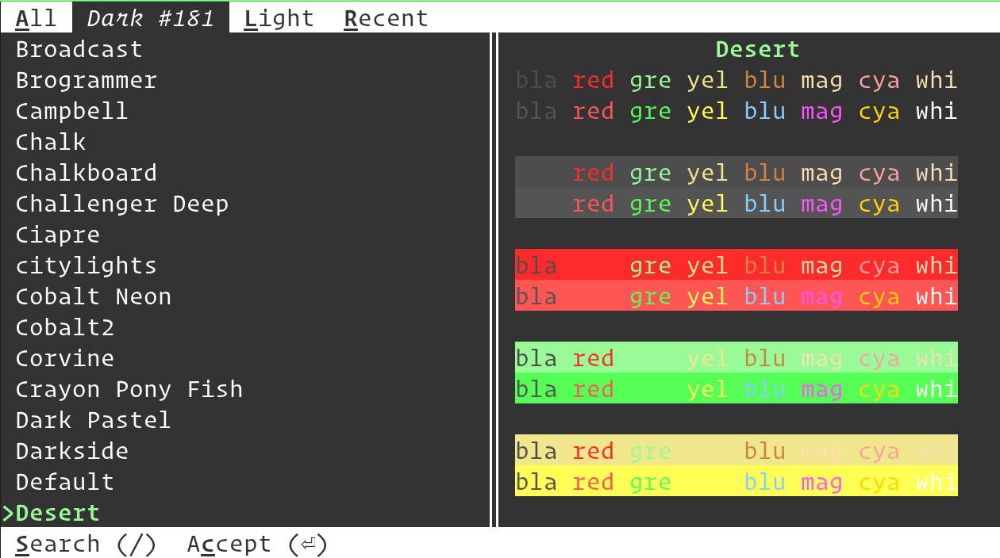

Themes for the kitty terminal
===============================

This is a collection of themes for the `kitty terminal emulator
<https://sw.kovidgoyal.net/kitty>`_.

The themes were initially imported from `dexpota/kitty-themes
<https://github.com/dexpota/kitty-themes>`_.

Using the themes
--------------------

The easiest way to use these themes is to run the `kitty
themes kitten <https://sw.kovidgoyal.net/kitty/kittens/themes/>`_::

    kitty +kitten themes

Contributing new themes
--------------------------

To contribute a new theme, use `template.conf <template.conf>`_ as
a base and modify it for your theme. Submit a `pull request
<https://docs.github.com/en/pull-requests/collaborating-with-pull-requests/proposing-changes-to-your-work-with-pull-requests/creating-a-pull-request>`_
with your new theme.

Problems with themes
-----------------------

If there are any issues with a theme please report them upstream to the theme
creator, as this repository is simply a centralised place to host all themes.

License
-------------
The overall license of this repository is the GPLv3, however, individual theme
files can have their own licenses, as specified in the theme file itself.
